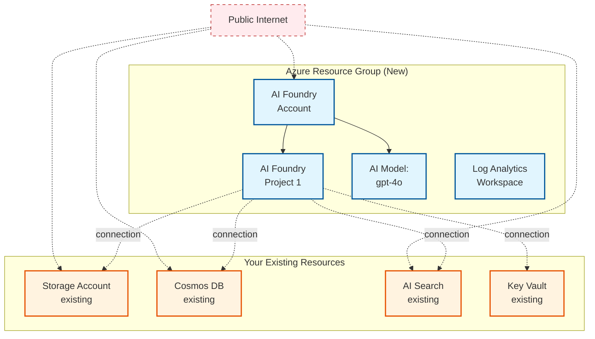

# Standard Public BYOR - Multi-Project AI Foundry with Existing Resources

This example shows how to deploy Azure AI Foundry with **multiple AI projects** that connect to **your own existing BYOR (Bring Your Own Resources)** services. This is useful when you already have Storage Accounts, Cosmos DB, AI Search, and Key Vault resources that you want to connect to AI Foundry projects.

## What This Example Does

This Terraform configuration creates an Azure AI Foundry environment where:

1. **Uses your existing resources** - Connects AI projects to existing Storage Account, Cosmos DB, AI Search, and Key Vault
2. **No new BYOR resources created** - Only creates AI Foundry account, projects, and connections
3. **Flexible resource sharing** - Multiple projects can share the same BYOR resources or use different ones
4. **Public access** - All services use public endpoints (no private networking)

### The Key Pattern: Existing Resource IDs

Instead of creating new BYOR resources, you provide the full Azure resource IDs of your existing resources. The module creates only the AI Foundry infrastructure and connections.

```hcl
# In terraform.tfvars, you specify existing resource IDs
ai_projects = {
  "project-1" = {
    name         = "project-1"
    display_name = "Development Project"
    
    cosmos_db_connection = {
      existing_resource_id = "/subscriptions/.../databaseAccounts/YOUR_COSMOS"
    }
    ai_search_connection = {
      existing_resource_id = "/subscriptions/.../searchServices/YOUR_SEARCH"
    }
    storage_account_connection = {
      existing_resource_id = "/subscriptions/.../storageAccounts/YOUR_STORAGE"
    }
    key_vault_connection = {
      existing_resource_id = "/subscriptions/.../vaults/YOUR_KEYVAULT"
    }
  }
}
```

The configuration automatically extracts unique resource IDs and creates the necessary connection definitions.

## What Gets Deployed

With the included `terraform.tfvars` configuration:

### Created by This Example
- **Azure AI Foundry Account** - The central AI platform
- **AI Foundry Projects** - Project workspaces
- **Resource Group** - Container for AI Foundry resources
- **Log Analytics Workspace** - Centralized logging
- **AI Models** - OpenAI model deployments (e.g., gpt-4o)
- **Connections** - Links between projects and existing BYOR resources
- **Managed Identities** - For each project to access BYOR resources
- **RBAC Role Assignments** - Permissions for projects to access existing resources

### NOT Created (You Provide These)
- ❌ Storage Account - Must already exist
- ❌ Cosmos DB Account - Must already exist
- ❌ AI Search Service - Must already exist
- ❌ Key Vault - Must already exist

## Prerequisites

Before using this example, you must have:

1. **Existing Azure Resources** with their full resource IDs:
   - Storage Account (StorageV2 or equivalent)
   - Cosmos DB Account (NoSQL API)
   - AI Search Service
   - Key Vault

2. **Permissions**:
   - Contributor or Owner on the subscription for creating AI Foundry resources
   - Permissions to assign RBAC roles on the existing BYOR resources

3. **Resource IDs** in the format:
   ```
   /subscriptions/{subscription-id}/resourceGroups/{rg-name}/providers/{provider}/{resource-name}
   ```

## How to Get Resource IDs

Use Azure CLI to get your existing resource IDs:

```bash
# Storage Account
az storage account show --name YOUR_STORAGE --resource-group YOUR_RG --query id -o tsv

# Cosmos DB
az cosmosdb show --name YOUR_COSMOS --resource-group YOUR_RG --query id -o tsv

# AI Search
az search service show --name YOUR_SEARCH --resource-group YOUR_RG --query id -o tsv

# Key Vault
az keyvault show --name YOUR_KEYVAULT --resource-group YOUR_RG --query id -o tsv
```

## Architecture Diagram



**Key:**
- 🔷 **Blue** - New resources created by this example
- 🟠 **Orange** - Your existing resources (not created)
- 🔴 **Red dashed lines** - Public internet access

## How to Configure This Example

### Step 1: Set Your Subscription ID

Edit `terraform.tfvars` and set your Azure subscription ID:

```hcl
subscription_id = "your-subscription-id-here"
```

### Step 2: Customize the Base Name (Optional)

The `base_name` is used as a prefix for AI Foundry resource names:

```hcl
base_name = "pubbyor"  # Default: "pubbyor"
```

### Step 3: Choose Your Azure Region (Optional)

Specify where you want to deploy AI Foundry resources:

```hcl
location = "eastus"  # Default: "australiaeast"
```

**Note:** Your existing BYOR resources can be in different regions.

### Step 4: Configure Projects with Existing Resource IDs

This is the critical step. Provide the full Azure resource IDs for your existing resources:

```hcl
ai_projects = {
  "project-1" = {
    name                       = "project-1"
    description                = "My AI project"
    display_name               = "Development Project"
    create_project_connections = true
    
    cosmos_db_connection = {
      existing_resource_id = "/subscriptions/12345678-1234-1234-1234-123456789012/resourceGroups/my-rg/providers/Microsoft.DocumentDB/databaseAccounts/my-cosmos"
    }
    ai_search_connection = {
      existing_resource_id = "/subscriptions/12345678-1234-1234-1234-123456789012/resourceGroups/my-rg/providers/Microsoft.Search/searchServices/my-search"
    }
    storage_account_connection = {
      existing_resource_id = "/subscriptions/12345678-1234-1234-1234-123456789012/resourceGroups/my-rg/providers/Microsoft.Storage/storageAccounts/mystorage"
    }
    key_vault_connection = {
      existing_resource_id = "/subscriptions/12345678-1234-1234-1234-123456789012/resourceGroups/my-rg/providers/Microsoft.KeyVault/vaults/my-kv"
    }
  }
}
```

**Important:** 
- Resource IDs must be complete and accurate
- Resources must exist before running Terraform
- The AI Foundry managed identity will be granted access to these resources

### Step 5: Add or Modify AI Models

Configure which OpenAI models to deploy:

```hcl
ai_model_deployments = {
  "gpt-4o" = {
    name = "gpt-4o"
    model = {
      format  = "OpenAI"
      name    = "gpt-4o"
      version = "2024-08-06"
    }
    scale = {
      type     = "Standard"
      capacity = 10
    }
  }
}
```

### Step 6: Other Configuration Options

```hcl
# Log Analytics retention
log_analytics_retention_days = 30  # Default: 30

# Enable diagnostic settings (sends BYOR logs to Log Analytics)
enable_diagnostic_settings = false  # Default: false
```

## Example: Multiple Projects Sharing Resources

You can have multiple projects share the same BYOR resources:

```hcl
ai_projects = {
  "project-1" = {
    name         = "project-1"
    display_name = "Development"
    create_project_connections = true
    cosmos_db_connection = {
      existing_resource_id = "/subscriptions/.../databaseAccounts/shared-cosmos"
    }
    ai_search_connection = {
      existing_resource_id = "/subscriptions/.../searchServices/shared-search"
    }
    storage_account_connection = {
      existing_resource_id = "/subscriptions/.../storageAccounts/sharedstorage"
    }
    key_vault_connection = {
      existing_resource_id = "/subscriptions/.../vaults/shared-kv"
    }
  },
  "project-2" = {
    name         = "project-2"
    display_name = "Production"
    create_project_connections = true
    # Same resource IDs - sharing BYOR resources
    cosmos_db_connection = {
      existing_resource_id = "/subscriptions/.../databaseAccounts/shared-cosmos"
    }
    ai_search_connection = {
      existing_resource_id = "/subscriptions/.../searchServices/shared-search"
    }
    storage_account_connection = {
      existing_resource_id = "/subscriptions/.../storageAccounts/sharedstorage"
    }
    key_vault_connection = {
      existing_resource_id = "/subscriptions/.../vaults/shared-kv"
    }
  }
}
```

## Deployment Steps

### Prerequisites
- Azure CLI installed and authenticated (`az login`)
- Terraform >= 1.9 installed
- Existing BYOR resources created
- Appropriate Azure permissions

### Deploy

```bash
# 1. Get your existing resource IDs
az storage account show --name YOUR_STORAGE --resource-group YOUR_RG --query id -o tsv
az cosmosdb show --name YOUR_COSMOS --resource-group YOUR_RG --query id -o tsv
az search service show --name YOUR_SEARCH --resource-group YOUR_RG --query id -o tsv
az keyvault show --name YOUR_KEYVAULT --resource-group YOUR_RG --query id -o tsv

# 2. Update terraform.tfvars with your resource IDs

# 3. Initialize Terraform
terraform init

# 4. Review what will be created
terraform plan

# 5. Create the resources
terraform apply
```

### Destroy

```bash
terraform destroy
```

**Note:** This will only destroy the AI Foundry resources. Your existing BYOR resources remain untouched.

## How It Works Internally

The configuration uses Terraform locals to dynamically build resource definition maps:

```hcl
# Extracts unique resource IDs from all projects
ai_search_definitions = {
  for project_key, project in var.ai_projects :
  project.ai_search_connection.existing_resource_id => {
    existing_resource_id       = project.ai_search_connection.existing_resource_id
    enable_diagnostic_settings = var.enable_diagnostic_settings
  }
  if project.create_project_connections && 
     try(project.ai_search_connection.existing_resource_id, null) != null
}
```

This ensures:
- ✅ No duplicate definitions if projects share resources
- ✅ Automatic handling of multiple projects
- ✅ Only resources with valid IDs are included

## When to Use This Example

**Use this pattern when:**
- ✅ You already have Storage/Cosmos/Search/KeyVault deployed
- ✅ You want to connect AI Foundry to centrally-managed resources
- ✅ Multiple projects should share the same BYOR resources
- ✅ You want to control BYOR lifecycle separately from AI Foundry
- ✅ Resources are managed by another team or Terraform workspace

**Don't use this pattern when:**
- ❌ You want Terraform to create all resources together (use `standard-public` instead)
- ❌ You need complete resource isolation per project
- ❌ You don't have existing BYOR resources

## Troubleshooting

### "Resource not found"
Verify the resource IDs are correct and the resources exist:
```bash
az resource show --ids "/subscriptions/.../YOUR_RESOURCE_ID"
```

### "Insufficient permissions"
Ensure you have permissions to:
- Create AI Foundry resources in the subscription
- Assign RBAC roles on the existing BYOR resources

### "Invalid resource ID format"
Resource IDs must be complete paths starting with `/subscriptions/...`

## RBAC Permissions

The module automatically grants the AI Foundry project's managed identity the following roles on existing resources:

- **Storage Account**: Storage Blob Data Contributor
- **Cosmos DB**: Cosmos DB Account Reader, Contributor
- **AI Search**: Search Service Contributor
- **Key Vault**: Key Vault Secrets User

Ensure these role assignments are acceptable for your security requirements.

## What Happens Next

After deployment:
1. Go to the Azure Portal → AI Foundry
2. Your AI Foundry account will have projects connected to existing resources
3. AI models are available in all projects
4. Projects have managed identities with RBAC permissions to existing BYOR resources
5. Start building AI applications in AI Foundry Studio

Your existing BYOR resources remain under your control and are not modified by this Terraform configuration.
