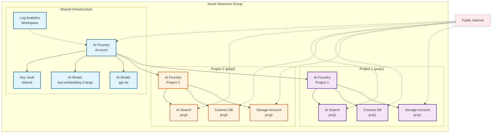

# Standard Public - Multi-Project AI Foundry with Per-Project BYOR

This example shows how to deploy Azure AI Foundry with **multiple isolated AI projects**, where each project gets its own dedicated BYOR (Bring Your Own Resources) services. This is useful when you want complete resource isolation between development, staging, and production environments, or between different teams/applications.

## What This Example Does

This Terraform configuration creates an Azure AI Foundry environment where:

1. **Each project is fully isolated** - Every AI project gets its own Storage Account, Cosmos DB, and AI Search service
2. **Shared infrastructure is minimal** - Only the AI Foundry account and Key Vault are shared across all projects
3. **Resources are dynamically generated** - You define your projects, and the Terraform code automatically creates the matching BYOR resources
4. **Public access** - All services use public endpoints (no private networking)

### The Key Pattern: Dynamic BYOR Generation

Instead of manually defining each BYOR resource, this example uses Terraform `locals` to automatically generate them based on your project definitions. When you add a new project in `terraform.tfvars`, the corresponding Storage, Cosmos DB, and AI Search resources are automatically created.

Here's how it works:

```hcl
# In main.tf, we extract unique BYOR keys from your project definitions
locals {
  byor_resource_keys = toset([
    for project_key, project in var.ai_projects : 
    project.create_project_connections ? try(project.storage_account_connection.new_resource_map_key, project_key) : null
    if project.create_project_connections
  ])
  
  # Then dynamically create BYOR definitions for each unique key
  ai_search_definitions = {
    for key in local.byor_resource_keys : key => {
      enable_diagnostic_settings = var.enable_diagnostic_settings
    }
  }
  # ... same for cosmosdb_definitions and storage_account_definitions
}
```

This means:
- **Project 1** uses `new_resource_map_key = "proj1"` → Creates Storage/Cosmos/Search with key "proj1"
- **Project 2** uses `new_resource_map_key = "proj2"` → Creates Storage/Cosmos/Search with key "proj2"
- **Key Vault** is always shared with key "shared" (only one needed)

## What Gets Deployed

With the included `terraform.tfvars` configuration (2 projects, 2 models):

### Shared Resources (1x each)
- **Azure AI Foundry Account** - The central AI platform
- **Key Vault** - Shared secrets/key management for all projects
- **Resource Group** - Container for all resources
- **Log Analytics Workspace** - Centralized logging

### Per-Project Resources (2x each - once for project-1, once for project-2)
- **AI Foundry Project** - Isolated workspace
- **Storage Account** - Project-specific blob storage
- **Cosmos DB Account** - Project-specific NoSQL database
- **AI Search Service** - Project-specific search capabilities
- **Managed Identity** - Project's identity for RBAC
- **RBAC Role Assignments** - Permissions to access the project's resources

### Shared AI Models (2 models deployed at account level)
- **gpt-4o** - GPT-4 Omni model
- **text-embedding-3-large** - OpenAI embeddings model

**Total:** ~11 main Azure resources + role assignments and connections


## Architecture Diagram



**Key:**
- 🔷 **Blue** - Shared across all projects
- 🟣 **Purple** - Project 1 dedicated resources
- 🟠 **Orange** - Project 2 dedicated resources
- 🔴 **Red dashed lines** - Public internet access

## How to Configure This Example

### Step 1: Set Your Subscription ID

The only required variable is your Azure subscription ID. Edit `terraform.tfvars`:

```hcl
subscription_id = "your-subscription-id-here"
```

### Step 2: Customize the Base Name (Optional)

The `base_name` is used as a prefix for all resource names. Change it to something meaningful for your environment:

```hcl
base_name = "mycompany"  # Default: "public"
```

This will create resources like `rg-mycompany-xxxxx`, `st-mycompany-xxxxx`, etc.

### Step 3: Choose Your Azure Region (Optional)

Specify where you want to deploy:

```hcl
location = "eastus"  # Default: "australiaeast"
```

### Step 4: Configure Your Projects

This is where the magic happens. Define your projects in the `ai_projects` map:

```hcl
ai_projects = {
  "project-1" = {
    name                       = "project-1"
    description                = "Development project"
    display_name               = "Dev Environment"
    create_project_connections = true
    
    # Each connection points to a BYOR resource key
    # Using the same key for all three means they all use the same BYOR set
    cosmos_db_connection = {
      new_resource_map_key = "proj1"  # This is the BYOR resource set identifier
    }
    ai_search_connection = {
      new_resource_map_key = "proj1"  # Same key = same BYOR set
    }
    storage_account_connection = {
      new_resource_map_key = "proj1"  # Same key = same BYOR set
    }
  }
}
```

**Important:** The `new_resource_map_key` value determines which BYOR resources (Storage/Cosmos/Search) get created:
- Use **different keys** for different projects to get separate BYOR resources
- Use the **same key** if you want multiple projects to share BYOR resources (though this is uncommon)

**Naming Rules:**
- Map keys (like `"project-1"`) can use hyphens but avoid underscores
- The `name` field will be used for the actual Azure resource name
- Keep names short and DNS-compatible

### Step 5: Add or Modify AI Models

Configure which OpenAI models to deploy:

```hcl
ai_model_deployments = {
  "gpt-4o" = {
    name = "gpt-4o"
    model = {
      format  = "OpenAI"
      name    = "gpt-4o"
      version = "2024-08-06"
    }
    scale = {
      type     = "Standard"      # or "GlobalStandard"
      capacity = 10              # TPM in thousands
    }
  }
}
```

Models are deployed at the **AI Foundry account level** and are accessible from all projects.

### Step 6: Other Configuration Options

```hcl
# Log Analytics retention
log_analytics_retention_days = 30  # Default: 30

# Enable diagnostic settings for BYOR resources (sends logs to Log Analytics)
enable_diagnostic_settings = false  # Default: false, set true to enable logging
```

## Example: Adding a Third Project

To add another project, just add a new entry to the `ai_projects` map:

```hcl
ai_projects = {
  "project-1" = { ... },
  "project-2" = { ... },
  "project-3" = {
    name         = "project-3"
    description  = "Testing environment"
    display_name = "Test Environment"
    create_project_connections = true
    cosmos_db_connection = {
      new_resource_map_key = "proj3"  # New BYOR set
    }
    ai_search_connection = {
      new_resource_map_key = "proj3"
    }
    storage_account_connection = {
      new_resource_map_key = "proj3"
    }
  }
}
```

When you run `terraform apply`, it will automatically:
1. Create a new AI Foundry Project named "project-3"
2. Create a new Storage Account with key "proj3"
3. Create a new Cosmos DB with key "proj3"
4. Create a new AI Search with key "proj3"
5. Wire up the connections between the project and its BYOR resources

No changes needed to `main.tf` - the dynamic locals handle everything!

## Deployment Steps

### Prerequisites
- Azure CLI installed and authenticated (`az login`)
- Terraform >= 1.9 installed
- Appropriate Azure permissions (Contributor or Owner on the subscription)

### Deploy

```bash
# 1. Initialize Terraform
terraform init

# 2. Review what will be created
terraform plan

# 3. Create the resources
terraform apply

# 4. Terraform will show you the plan and ask for confirmation
# Type 'yes' to proceed
```

### Destroy

```bash
terraform destroy
```

**Note:** The configuration includes an `azapi_resource_action` that purges soft-deleted AI Foundry accounts during destroy, ensuring you can redeploy with the same names.

## Understanding the Resource Keys

The configuration uses **resource map keys** to link projects to their BYOR resources. Here's how it works:

1. **You define projects** with `new_resource_map_key` values:
   ```hcl
   storage_account_connection = {
     new_resource_map_key = "proj1"
   }
   ```

2. **Terraform extracts unique keys** from all projects (in this case: `["proj1", "proj2"]`)

3. **Terraform creates BYOR definitions** for each key:
   ```hcl
   storage_account_definitions = {
     "proj1" = { ... }
     "proj2" = { ... }
   }
   ```

4. **The AI Foundry module** matches the `new_resource_map_key` to create the right connections

This pattern ensures:
- ✅ No duplicate BYOR resources (even if multiple projects use the same key)
- ✅ Automatic scaling (add projects without touching resource definitions)
- ✅ Clear isolation (different keys = different resources)

## Key Vault Sharing Pattern

Notice that Key Vault is handled differently:

```hcl
key_vault_definitions = {
  "shared" = {
    enable_diagnostic_settings = var.enable_diagnostic_settings
  }
}
```

Key Vault is always created with the key `"shared"` because:
- AI Foundry uses Key Vault at the **account level**, not project level
- Projects don't need individual Key Vaults
- This saves costs and reduces complexity

## When to Use This Example

**Use this pattern when:**
- ✅ You need complete resource isolation between projects
- ✅ Different teams/applications should have separate data stores
- ✅ You want to track costs per project/environment
- ✅ Compliance requires separate Cosmos DB/Storage per environment

**Don't use this pattern when:**
- ❌ You want projects to share the same Storage/Cosmos/Search (use shared BYOR keys instead)
- ❌ You need private networking (see the `private` example instead)
- ❌ You only need a single project (simpler configurations are available)

## Troubleshooting

### "Connection name already exists"
This happens when multiple projects try to create connections with the same name. Make sure each project uses a **unique** `new_resource_map_key` value.

### "Invalid resource name"
Azure resource names have restrictions (no underscores, length limits, etc.). Use hyphens instead of underscores in your `new_resource_map_key` values.

### "Insufficient permissions"
You need Contributor or Owner role on the subscription to create resources and assign RBAC roles.

## What Happens Next

After deployment:
1. Go to the Azure Portal → AI Foundry
2. You'll see your AI Foundry account with two projects
3. Each project has its own connections to Storage, Cosmos DB, and AI Search
4. Both AI models (gpt-4o, text-embedding) are available in all projects
5. You can start building AI applications in AI Foundry Studio

The projects are completely isolated - data in Project 1's storage won't appear in Project 2, and vice versa.
