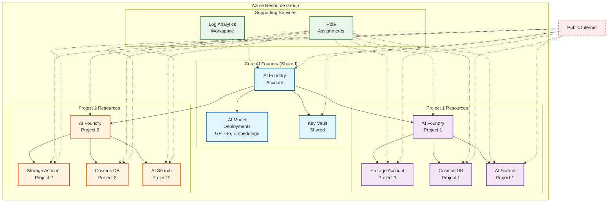

````markdown
<!-- BEGIN_TF_DOCS -->
<!-- Code generated by terraform-docs. DO NOT EDIT. -->
# Standard Public - Multi-Project AI Foundry Deployment

This example demonstrates a complete Azure AI Foundry deployment with **multiple projects**, each with dedicated BYOR (Bring Your Own Resources) services, all accessible via public endpoints.

## Overview

This configuration showcases:
- **Multiple AI Projects** - Deploy multiple isolated AI Foundry projects (dev, prod, etc.)
- **Per-Project BYOR Resources** - Each project gets its own Storage, Cosmos DB, and AI Search
- **Shared Infrastructure** - Key Vault and AI Foundry account shared across projects
- **Dynamic Configuration** - BYOR resources automatically generated based on project definitions
- **Configurable AI Models** - Deploy multiple OpenAI models with customizable settings
- **Public Access** - All services accessible from the internet (no private endpoints)

## What Gets Created

### Per Deployment (Shared)
- **1x Azure AI Foundry Account** - Central AI platform account
- **1x Key Vault** - Shared secrets and key management
- **1x Log Analytics Workspace** - Centralized monitoring and logging
- **1x Resource Group** - Container for all resources

### Per Project (Dedicated)
For each project defined in `ai_projects`:
- **1x AI Foundry Project** - Isolated workspace for AI development
- **1x Storage Account** - Blob storage for project data and artifacts
- **1x Cosmos DB Account** - NoSQL database for project metadata
- **1x AI Search Service** - Cognitive search capabilities
- **RBAC Role Assignments** - Managed identity permissions for resource access

### AI Model Deployments (Shared)
Configurable via `ai_model_deployments`:
- OpenAI model deployments (GPT-4, embeddings, etc.)
- Shared across all projects in the AI Foundry account

### Current Example Configuration
With the provided `terraform.tfvars`:
- **2 AI Projects** (`project-1`, `project-2`)
- **2 AI Models** (GPT-4o, text-embedding-3-large)
- **Total: 11 main resources** + supporting role assignments

## Architecture

This example deploys AI Foundry with dedicated BYOR services per project using public access:



**Legend:**
- 🔷 **Shared Resources** (Blue) - AI Foundry Account, AI Models, Key Vault
- 🟣 **Project 1 Resources** (Purple) - Dedicated BYOR services
- 🟠 **Project 2 Resources** (Orange) - Dedicated BYOR services
- 🟢 **Supporting** (Green) - Monitoring and RBAC
- 🔴 **Public Access** (Red dashed) - Internet-accessible endpoints

## Key Features

### Dynamic BYOR Resource Generation
The configuration automatically generates BYOR resource definitions based on your project definitions:
```hcl
# Define projects in terraform.tfvars
ai_projects = {
  "project-1" = { ... }
  "project-2" = { ... }
}

# BYOR resources are automatically created per project
# No need to manually define storage_account_definition, cosmosdb_definition, etc.
```

### Flexible Model Deployment
Add or modify AI models easily:
```hcl
ai_model_deployments = {
  "gpt-4o" = { ... }
  "text-embedding-3-large" = { ... }
  # Add more models as needed
}
```

### Per-Project Isolation
Each project gets:
- Its own data stores (Storage, Cosmos DB, AI Search)
- Dedicated managed identities with scoped RBAC
- Independent connections to BYOR resources
- Isolated workspaces for development teams

## Configuration Variables

### Required
- `subscription_id` - Azure subscription ID

### Key Configuration
- `base_name` - Prefix for resource names (default: "public")
- `location` - Azure region (default: "swedencentral")
- `ai_projects` - Map of AI projects to create
- `ai_model_deployments` - Map of AI models to deploy

### Example terraform.tfvars
See the included `terraform.tfvars` for a complete working example with 2 projects and 2 models.

## Usage

1. Copy `terraform.tfvars.example` to `terraform.tfvars`
2. Update `subscription_id` and other variables
3. Run `terraform init`
4. Run `terraform plan` to review changes
5. Run `terraform apply` to create resources

To add a third project, simply add another entry to `ai_projects` in your tfvars file - the BYOR resources will be created automatically.

## Components:**
- 🔷 **Core AI Foundry** (Account, Project, Model Deployment)
- 🔶 **BYOR Services** created by the module (Key Vault, Storage, Cosmos DB, AI Search)
- 🔸 **Supporting Services** (Log Analytics, Role Assignments)
- 🔷 **Public Access** - All services accessible from the internet

This configuration provides a complete AI Foundry setup with supporting services while maintaining public accessibility for simplified access patterns.

```hcl
terraform {
  required_version = ">= 1.9, < 2.0"

  required_providers {
    azapi = {
      source  = "Azure/azapi"
      version = "~> 2.0"
    }
    azurerm = {
      source  = "hashicorp/azurerm"
      version = "~> 4.0"
    }
    random = {
      source  = "hashicorp/random"
      version = "~> 3.5"
    }
  }
}

provider "azurerm" {
  storage_use_azuread = true
  features {
    resource_group {
      prevent_deletion_if_contains_resources = false
    }
    cognitive_account {
      purge_soft_delete_on_destroy = true
    }
  }
}

data "azurerm_client_config" "current" {}

locals {
  base_name = "public"
}

module "regions" {
  source  = "Azure/avm-utl-regions/azurerm"
  version = "0.5.2"

  availability_zones_filter = true
  geography_filter          = "Australia"
}

resource "random_shuffle" "locations" {
  input        = module.regions.valid_region_names
  result_count = 3
}

module "naming" {
  source  = "Azure/naming/azurerm"
  version = "0.4.2"

  suffix        = [local.base_name]
  unique-length = 5
}

resource "azurerm_resource_group" "this" {
  location = random_shuffle.locations.result[0]
  name     = module.naming.resource_group.name_unique
}

resource "azurerm_log_analytics_workspace" "this" {
  location            = azurerm_resource_group.this.location
  name                = module.naming.log_analytics_workspace.name_unique
  resource_group_name = azurerm_resource_group.this.name
  retention_in_days   = 30
  sku                 = "PerGB2018"
}

module "ai_foundry" {
  source = "../../"

  base_name                  = local.base_name
  location                   = azurerm_resource_group.this.location
  resource_group_resource_id = azurerm_resource_group.this.id
  ai_foundry = {
    create_ai_agent_service = true
    name                    = module.naming.cognitive_account.name_unique
  }
  ai_model_deployments = {
    "gpt-4o" = {
      name = "gpt-4.1"
      model = {
        format  = "OpenAI"
        name    = "gpt-4.1"
        version = "2025-04-14"
      }
      scale = {
        type     = "GlobalStandard"
        capacity = 1
      }
    }
  }
  ai_projects = {
    project_1 = {
      name                       = "project-1"
      description                = "Project 1 description"
      display_name               = "Project 1 Display Name"
      create_project_connections = true
      cosmos_db_connection = {
        new_resource_map_key = "this"
      }
      ai_search_connection = {
        new_resource_map_key = "this"
      }
      storage_account_connection = {
        new_resource_map_key = "this"
      }
    }
  }
  ai_search_definition = {
    this = {
      enable_diagnostic_settings = false
    }
  }
  cosmosdb_definition = {
    this = {
      enable_diagnostic_settings = false
    }
  }
  create_byor              = true
  create_private_endpoints = false # default: false
  key_vault_definition = {
    this = {
      enable_diagnostic_settings = false
    }
  }
  storage_account_definition = {
    this = {
      enable_diagnostic_settings = false
    }
  }

  depends_on = [azapi_resource_action.purge_ai_foundry]
}

resource "azapi_resource_action" "purge_ai_foundry" {
  method      = "DELETE"
  resource_id = "/subscriptions/${data.azurerm_client_config.current.subscription_id}/providers/Microsoft.CognitiveServices/locations/${azurerm_resource_group.this.location}/resourceGroups/${azurerm_resource_group.this.name}/deletedAccounts/${module.naming.cognitive_account.name_unique}"
  type        = "Microsoft.Resources/resourceGroups/deletedAccounts@2021-04-30"
  when        = "destroy"
}
```

<!-- markdownlint-disable MD033 -->
## Requirements

The following requirements are needed by this module:

- <a name="requirement_terraform"></a> [terraform](#requirement\_terraform) (>= 1.9, < 2.0)

- <a name="requirement_azapi"></a> [azapi](#requirement\_azapi) (~> 2.0)

- <a name="requirement_azurerm"></a> [azurerm](#requirement\_azurerm) (~> 4.0)

- <a name="requirement_random"></a> [random](#requirement\_random) (~> 3.5)

## Resources

The following resources are used by this module:

- [azapi_resource_action.purge_ai_foundry](https://registry.terraform.io/providers/Azure/azapi/latest/docs/resources/resource_action) (resource)
- [azurerm_log_analytics_workspace.this](https://registry.terraform.io/providers/hashicorp/azurerm/latest/docs/resources/log_analytics_workspace) (resource)
- [azurerm_resource_group.this](https://registry.terraform.io/providers/hashicorp/azurerm/latest/docs/resources/resource_group) (resource)
- [random_shuffle.locations](https://registry.terraform.io/providers/hashicorp/random/latest/docs/resources/shuffle) (resource)
- [azurerm_client_config.current](https://registry.terraform.io/providers/hashicorp/azurerm/latest/docs/data-sources/client_config) (data source)

<!-- markdownlint-disable MD013 -->
## Required Inputs

No required inputs.

## Optional Inputs

No optional inputs.

## Outputs

No outputs.

## Modules

The following Modules are called:

### <a name="module_ai_foundry"></a> [ai\_foundry](#module\_ai\_foundry)

Source: ../../

Version:

### <a name="module_naming"></a> [naming](#module\_naming)

Source: Azure/naming/azurerm

Version: 0.4.2

### <a name="module_regions"></a> [regions](#module\_regions)

Source: Azure/avm-utl-regions/azurerm

Version: 0.5.2

<!-- markdownlint-disable-next-line MD041 -->
## Data Collection

The software may collect information about you and your use of the software and send it to Microsoft. Microsoft may use this information to provide services and improve our products and services. You may turn off the telemetry as described in the repository. There are also some features in the software that may enable you and Microsoft to collect data from users of your applications. If you use these features, you must comply with applicable law, including providing appropriate notices to users of your applications together with a copy of Microsoft’s privacy statement. Our privacy statement is located at <https://go.microsoft.com/fwlink/?LinkID=824704>. You can learn more about data collection and use in the help documentation and our privacy statement. Your use of the software operates as your consent to these practices.
<!-- END_TF_DOCS -->